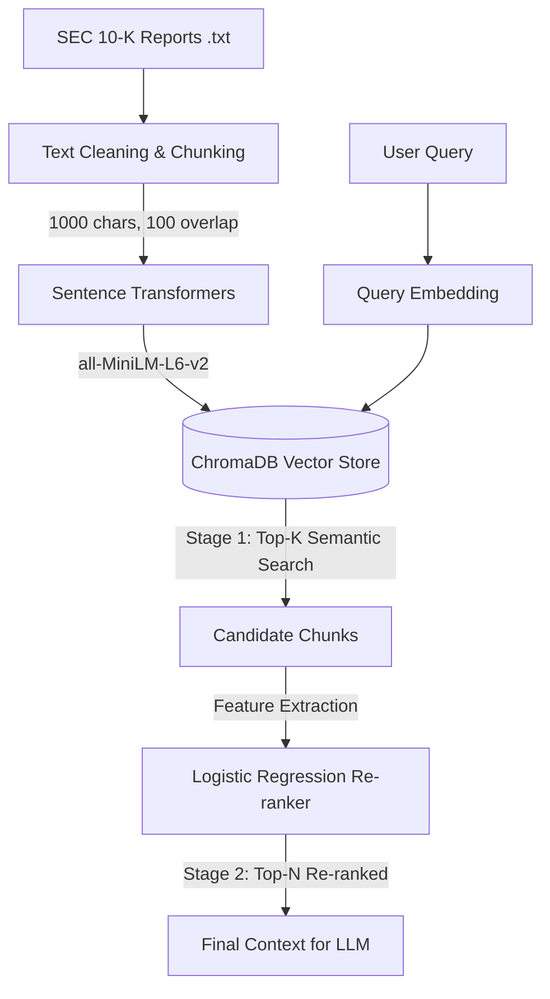

# 🔍 Financial RAG — Semantic Search Q&A System with ML Re-ranking

A production-ready **Two-Stage Retrieval-Augmented Generation (RAG)** pipeline for intelligent question answering over complex financial documents (SEC 10-K filings).

Combines **Sentence Transformers**, scalable vector storage (**ChromaDB**), and a custom **Logistic Regression Re-ranker** to deliver highly accurate context retrieval for financial queries.

---

## 🏗️ Architecture: Two-Stage Retrieval Pipeline



---

## ⚙️ How It Works
### 1. Document Processing & Ingestion
- **Source Data:** SEC 10-K Filings (Apple, Microsoft, Tesla, etc.)
- **Chunking:** 1000-character windows with 100-character overlap to preserve semantic context
- **Embeddings:** `all-MiniLM-L6-v2` → 384-dimensional dense vectors
- **Storage:** Persistent ChromaDB collection with Cosine Similarity index

### 2. Two-Stage Retrieval (The Core)

To solve the problem of generic semantic search failing on specific financial metrics, this project implements a two-stage approach:

| Stage | Method | Goal |
|-------|--------|------|
| **Stage 1 — Dense Retrieval** | ChromaDB cosine similarity | High recall: fetch top-20 candidates |
| **Stage 2 — ML Re-ranking** | Logistic Regression classifier | High precision: re-rank by financial relevance |

The re-ranker uses engineered features — `financial_score` (detects dollar amounts and percentages) alongside raw semantic distance — ensuring mathematically heavy paragraphs surface first for financial queries.

---

## 📊 Performance & Metrics

| Metric | Value |
|--------|-------|
| Document type | SEC 10-K Filings |
| Chunk size | 1000 chars (100 overlap) |
| Embedding model | `all-MiniLM-L6-v2` |
| Re-ranker | Logistic Regression (scikit-learn) |
| Vector DB | ChromaDB (persistent) |
| Stage 1 candidates | Top-20 semantic search |
| Metadata filtering | ✅ per-company (`where={"ticker": "AAPL"}`) |

---

## 🛠️ Tech Stack

| Component | Technology |
|-----------|-----------|
| Language | Python 3.10+ |
| Vector Store | ChromaDB |
| Embeddings | sentence-transformers |
| Machine Learning | scikit-learn, numpy, pandas |
| Visualization | matplotlib, seaborn |
| Notebook | JupyterLab |

---

## 🚀 Quick Start

**1. Clone the repository**
```bash
git clone https://github.com/yaroslavfedchenko11-rgb/financial-rag.git
cd financial-rag
```

**2. Install dependencies**
```bash
pip install -r requirements.txt
```

**3. Run the pipeline**
```bash
jupyter notebook notebooks/financial_rag_semantic_final.ipynb
```

---

## 📁 Project Structure

```
financial-rag/
├── data/
│   └── financial_docs/       # Place SEC 10-K .txt files here
├── notebooks/
│   └── financial_rag_semantic_final.ipynb  # Main pipeline & experiments
├── README.md
└── requirements.txt
```

---

## 💡 Key Highlights

- **Smart Data Cleaning** — Custom RegEx filters remove SEC boilerplate (TOC, page numbers)
- **Feature Engineering** — Visualized feature importance (coefficients) to prove why the re-ranker prioritizes certain chunks
- **Metadata Filtering** — Query specific companies directly in ChromaDB via `where={"ticker": "AAPL"}`
- **Two-stage design** — Separates recall (semantic) from precision (ML), a pattern used in production search systems

---

## 📋 Requirements

```
chromadb>=0.4.0
sentence-transformers>=2.2.0
scikit-learn>=1.3.0
pandas>=2.0.0
numpy>=1.24.0
matplotlib>=3.7.0
seaborn>=0.12.0
jupyterlab>=4.0.0
```
